# Documentación Técnica de Base de Datos del Sistema SMG

**Para:** Administradores de Base de Datos, Desarrolladores, Arquitectos de Datos  
**De:** Gemini (Asistente de BitEra Digital)  
**Fecha:** 19 de agosto de 2025  
**Versión:** 1.9 (Automatización e Identificación de Productos)  

## 1. El Modelo Entidad-Relación (ERD): La Visión Conceptual

El Modelo Entidad-Relación (ERD) es la representación conceptual de alto nivel de la estructura de datos del negocio de SMG. Es un plano visual que muestra las entidades clave y cómo se relacionan entre sí.

### 1.1. Elementos Clave del ERD
*   **Entidades (Rectángulos):** Representan objetos, personas, conceptos o eventos sobre los que se recopila información. En SMG, ejemplos son `PROVEEDORES`, `PRODUCTOS_SERVICIOS`, `CLIENTES`, `ORDENES_COMPRA`, etc.
*   **Atributos (Óvalos/Círculos):** Describen propiedades o características de las entidades (ej., `Nombre_Proveedor` para `PROVEEDORES`).
*   **Clave Primaria (PK):** Atributo que identifica de forma única cada instancia de una entidad (subrayado).
*   **Clave Foránea (FK):** Atributo en una entidad que hace referencia a la PK de otra, estableciendo relaciones.
*   **Relaciones (Rombos/Líneas):** Vinculan entidades, indicando cómo interactúan (ej., `PROVEEDORES` "realiza" `ORDENES_COMPRA`).
*   **Cardinalidades:** Definen cuántas instancias de una entidad se relacionan con cuántas de otra (ej., 1:N - uno a muchos, 1:1 - uno a uno).

### 1.2. Diagrama Entidad-Relación (ERD) Consolidado

```mermaid
erDiagram
    PROVEEDORES ||--o{ ORDENES_COMPRA : "realiza"
    ORDENES_COMPRA ||--o{ DETALLES_ORDEN : "contiene"
    PRODUCTOS_SERVICIOS ||--o{ DETALLES_ORDEN : "incluye"
    PRODUCTOS_SERVICIOS ||--o{ STOCK_DEPOSITO : "tiene_lote"
    ORDENES_COMPRA ||--o{ RECEPCIONES_MERCADERIA : "corresponde_a"
    RECEPCIONES_MERCADERIA ||--o{ DETALLES_RECEPCION : "contiene"
    PRODUCTOS_SERVICIOS ||--o{ DETALLES_RECEPCION : "registra_recibido"
    STOCK_DEPOSITO ||--o{ DETALLES_ORDEN_CARGA : "decrementa_lote_cargado"
    EMPLEADOS ||--o{ ORDENES_CARGA : "asigna_chofer"
    VEHICULOS ||--o{ ORDENES_CARGA : "utiliza"
    ORDENES_CARGA ||--o{ DETALLES_ORDEN_CARGA : "registra_carga"
    PRODUCTOS_SERVICIOS ||--o{ DETALLES_ORDEN_CARGA : "carga_producto"
    EMPLEADOS ||--o{ DETALLES_ORDEN_CARGA : "realiza_carga"
    
    CLIENTES ||--o{ PEDIDOS_CLIENTE : "realiza"
    PEDIDOS_CLIENTE ||--o{ DETALLES_PEDIDO_CLIENTE : "contiene"
    PRODUCTOS_SERVICIOS ||--o{ DETALLES_PEDIDO_CLIENTE : "solicita"

    ORDENES_CARGA ||--o{ PEDIDOS_CARGADOS : "incluye_pedido"
    PEDIDOS_CLIENTE ||--o{ PEDIDOS_CARGADOS : "es_parte_de_carga"

    ORDENES_CARGA ||--|| ORDENES_TRANSPORTE : "genera"
    RUTAS ||--o{ ORDENES_TRANSPORTE : "asigna_ruta"
    ORDENES_TRANSPORTE ||--o{ DESTINOS_TRANSPORTE : "tiene_destino"
    SUCURSALES_CLIENTE ||--o{ DESTINOS_TRANSPORTE : "es_sucursal_destino"
    DESTINOS_TRANSPORTE ||--o{ DETALLES_DESTINO_TRANSPORTE : "contiene_producto_planificado"
    PRODUCTOS_SERVICIOS ||--o{ DETALLES_DESTINO_TRANSPORTE : "define_producto_planificado"

    DESTINOS_TRANSPORTE ||--o{ ORDENES_VENTA : "origina_venta"
    EMPLEADOS ||--o{ ORDENES_VENTA : "realiza_venta"
    ORDENES_VENTA ||--o{ DETALLES_ORDEN_VENTA : "compone"
    PRODUCTOS_SERVICIOS ||--o{ DETALLES_ORDEN_VENTA : "vende"
    ORDENES_VENTA }o--|| FACTURAS : "genera_factura"

    ORDENES_VENTA ||--o{ PAGOS_RECIBIDOS : "recibe_pago"

    CLIENTES ||--o{ INTERACCIONES_CLIENTE : "tiene_interaccion"
    EMPLEADOS ||--o{ INTERACCIONES_CLIENTE : "registra_interaccion"

    CLIENTES ||--o{ USUARIOS_CLIENTES : "tiene_usuario"

    EMPLEADOS ||--o{ RENDIMIENTO_EMPLEADO : "evalua_rendimiento"
    EMPLEADOS ||--o{ METAS_EMPLEADO : "asigna_meta"

    PRODUCTOS_SERVICIOS ||--o{ CLIENTE_PREFERENCIAS : "es_preferencia"
    CLIENTES ||--o{ CLIENTE_PREFERENCIAS : "tiene_preferencia"

    ORDENES_CARGA ||--o{ RUTAS_SUGERIDAS : "sugiere_ruta_para_carga"
    RUTAS_SUGERIDAS ||--o{ DETALLES_RUTA_SUGERIDA : "detalla_parada"
    SUCURSALES_CLIENTE ||--o{ DETALLES_RUTA_SUGERIDA : "es_parada_sugerida"

    UNIDADES_MEDIDA ||--o{ PRODUCTOS_SERVICIOS : "define_unidad_compra"
    UNIDADES_MEDIDA ||--o{ PRODUCTOS_SERVICIOS : "define_unidad_venta"
    UNIDADES_MEDIDA ||--o{ PRODUCTOS_SERVICIOS : "define_unidad_base"
    PRODUCTOS_SERVICIOS ||--o{ PRODUCTO_UNIDADES_CONVERSION : "tiene_conversion"
    UNIDADES_MEDIDA ||--o{ PRODUCTO_UNIDADES_CONVERSION : "es_unidad_mayor"
    UNIDADES_MEDIDA ||--o{ PRODUCTO_UNIDADES_CONVERSION : "es_unidad_menor"

    CLIENTES ||--o{ SUCURSALES_CLIENTE : "tiene_sucursal"
    SUCURSALES_CLIENTE ||--o{ PEDIDOS_CLIENTE : "realiza_pedido_en_sucursal"
    SUCURSALES_CLIENTE ||--o{ INTERACCIONES_CLIENTE : "interaccion_en_sucursal"
    SUCURSALES_CLIENTE ||--o{ USUARIOS_CLIENTES : "usuario_de_sucursal"
```



## 2. El Modelo Relacional: La Estructura Lógica de la Base de Datos

El Modelo Relacional es la traducción del diseño conceptual (ERD) a una estructura lógica que puede ser implementada en un Sistema de Gestión de Bases de Datos (DBMS). Aquí, las entidades se convierten en tablas, los atributos en columnas, y las relaciones se implementan mediante claves primarias y foráneas. Este modelo es la base directa para la creación del esquema de la base de datos física.

### 2.1. Esquema de Base de Datos (Representación de Tablas)

A continuación, se presenta el esquema de la base de datos, mostrando la estructura de cada tabla con sus columnas, tipos de datos y restricciones clave.

```sql
-- Esquema de Base de Datos SMG

-- Tabla: UNIDADES_MEDIDA
CREATE TABLE UNIDADES_MEDIDA (
    ID_Unidad INT PRIMARY KEY,
    Nombre_Unidad VARCHAR(50) NOT NULL,
    Abreviatura VARCHAR(10),
    Tipo_Unidad VARCHAR(50)
);

-- Tabla: PRODUCTO_UNIDADES_CONVERSION
CREATE TABLE PRODUCTO_UNIDADES_CONVERSION (
    ID_Conversion INT PRIMARY KEY,
    ID_Producto_Servicio INT NOT NULL,
    ID_Unidad_Mayor INT NOT NULL,
    ID_Unidad_Menor INT NOT NULL,
    Factor_Conversion DECIMAL(10, 4) NOT NULL,
    Es_Unidad_Compra_Producto BOOLEAN NOT NULL,
    Es_Unidad_Venta_Producto BOOLEAN NOT NULL,
    UNIQUE (ID_Producto_Servicio, ID_Unidad_Mayor, ID_Unidad_Menor),
    FOREIGN KEY (ID_Producto_Servicio) REFERENCES PRODUCTOS_SERVICIOS(ID_Producto_Servicio),
    FOREIGN KEY (ID_Unidad_Mayor) REFERENCES UNIDADES_MEDIDA(ID_Unidad),
    FOREIGN KEY (ID_Unidad_Menor) REFERENCES UNIDADES_MEDIDA(ID_Unidad)
);

-- Tabla: PROVEEDORES
CREATE TABLE PROVEEDORES (
    ID_Proveedor INT PRIMARY KEY,
    Nombre_Proveedor VARCHAR(255) NOT NULL,
    Contacto_Proveedor VARCHAR(255),
    Telefono_Proveedor VARCHAR(50),
    Email_Proveedor VARCHAR(255),
    Direccion_Proveedor VARCHAR(255),
    RUT_Proveedor VARCHAR(12) UNIQUE NOT NULL
);

-- Tabla: PRODUCTOS_SERVICIOS
CREATE TABLE PRODUCTOS_SERVICIOS (
    ID_Producto_Servicio INT PRIMARY KEY,
    Nombre_Producto_Servicio VARCHAR(255) NOT NULL,
    Descripcion_Producto_Servicio TEXT,
    Precio_Unitario_Sugerido DECIMAL(10, 2),
    Tiempo_Entrega_Proveedor_Dias INT,
    Stock_Seguridad_Minimo INT,
    Punto_Reorden INT,
    Cantidad_Reorden_Optima INT,
    ID_Unidad_Compra INT,
    ID_Unidad_Venta INT,
    ID_Unidad_Base INT NOT NULL,
    Codigo_Barras VARCHAR(255) UNIQUE,
    Codigo_QR VARCHAR(255) UNIQUE,
    FOREIGN KEY (ID_Unidad_Compra) REFERENCES UNIDADES_MEDIDA(ID_Unidad),
    FOREIGN KEY (ID_Unidad_Venta) REFERENCES UNIDADES_MEDIDA(ID_Unidad),
    FOREIGN KEY (ID_Unidad_Base) REFERENCES UNIDADES_MEDIDA(ID_Unidad)
);

-- Tabla: ORDENES_COMPRA
CREATE TABLE ORDENES_COMPRA (
    ID_Orden INT PRIMARY KEY,
    Fecha_Creacion DATE NOT NULL,
    Fecha_Entrega_Estimada DATE,
    Estado_Orden VARCHAR(50) NOT NULL DEFAULT 'Pendiente',
    Fecha_Confirmacion_Proveedor DATETIME,
    Notas_Proveedor_Confirmacion TEXT,
    Total_Orden DECIMAL(10, 2) NOT NULL,
    Notas TEXT,
    ID_Proveedor INT NOT NULL,
    FOREIGN KEY (ID_Proveedor) REFERENCES PROVEEDORES(ID_Proveedor)
);

-- Tabla: DETALLES_ORDEN
CREATE TABLE DETALLES_ORDEN (
    ID_Detalle_Orden INT PRIMARY KEY,
    ID_Orden INT NOT NULL,
    ID_Producto_Servicio INT NOT NULL,
    Cantidad INT NOT NULL, -- Cantidad en ID_Unidad_Compra del producto
    Precio_Unitario_Acordado DECIMAL(10, 2) NOT NULL,
    Subtotal_Linea DECIMAL(10, 2) GENERATED ALWAYS AS (Cantidad * Precio_Unitario_Acordado) STORED NOT NULL,
    FOREIGN KEY (ID_Orden) REFERENCES ORDENES_COMPRA(ID_Orden),
    FOREIGN KEY (ID_Producto_Servicio) REFERENCES PRODUCTOS_SERVICIOS(ID_Producto_Servicio)
);

-- Tabla: RECEPCIONES_MERCADERIA
CREATE TABLE RECEPCIONES_MERCADERIA (
    ID_Recepcion INT PRIMARY KEY,
    ID_Orden INT NOT NULL,
    Fecha_Recepcion DATETIME NOT NULL,
    Nro_Guia_Remision VARCHAR(100),
    Observaciones TEXT,
    FOREIGN KEY (ID_Orden) REFERENCES ORDENES_COMPRA(ID_Orden)
);

-- Tabla: DETALLES_RECEPCION
CREATE TABLE DETALLES_RECEPCION (
    ID_Detalle_Recepcion INT PRIMARY KEY,
    ID_Recepcion INT NOT NULL,
    ID_Producto_Servicio INT NOT NULL,
    Cantidad_Recibida INT NOT NULL, -- Cantidad en ID_Unidad_Compra del producto
    Fecha_Vencimiento DATE NOT NULL,
    Numero_Lote VARCHAR(100),
    Cantidad_Recibida_Unidad_Base INT GENERATED ALWAYS AS (...) STORED,
    FOREIGN KEY (ID_Recepcion) REFERENCES RECEPCIONES_MERCADERIA(ID_Recepcion),
    FOREIGN KEY (ID_Producto_Servicio) REFERENCES PRODUCTOS_SERVICIOS(ID_Producto_Servicio)
);

-- Tabla: STOCK_DEPOSITO
CREATE TABLE STOCK_DEPOSITO (
    ID_Stock INT PRIMARY KEY,
    ID_Producto_Servicio INT NOT NULL,
    Numero_Lote VARCHAR(100) NOT NULL,
    Fecha_Vencimiento DATE NOT NULL,
    Cantidad_Actual_Lote INT NOT NULL, -- Cantidad en ID_Unidad_Base del producto
    Ultima_Actualizacion_Lote DATETIME NOT NULL,
    UNIQUE (ID_Producto_Servicio, Numero_Lote, Fecha_Vencimiento),
    FOREIGN KEY (ID_Producto_Servicio) REFERENCES PRODUCTOS_SERVICIOS(ID_Producto_Servicio)
);

-- Tabla: EMPLEADOS
CREATE TABLE EMPLEADOS (
    ID_Empleado INT PRIMARY KEY,
    Nombres VARCHAR(100) NOT NULL,
    Apellidos VARCHAR(100) NOT NULL,
    RUT_Empleado VARCHAR(12) UNIQUE NOT NULL,
    Fecha_Nacimiento DATE,
    Telefono VARCHAR(50),
    Email VARCHAR(255),
    Fecha_Contratacion DATE NOT NULL,
    Cargo VARCHAR(50) NOT NULL
);

-- Tabla: VEHICULOS
CREATE TABLE VEHICULOS (
    ID_Vehiculo INT PRIMARY KEY,
    Patente VARCHAR(10) UNIQUE NOT NULL,
    Marca VARCHAR(50),
    Modelo VARCHAR(50),
    Ano INT,
    Tipo_Vehiculo VARCHAR(50),
    Capacidad_Carga_KG DECIMAL(10, 2),
    Estado_Vehiculo VARCHAR(50)
);

-- Tabla: ORDENES_CARGA
CREATE TABLE ORDENES_CARGA (
    ID_Orden_Carga INT PRIMARY KEY,
    Fecha_Carga DATETIME NOT NULL,
    ID_Vehiculo INT NOT NULL,
    ID_Chofer INT NOT NULL,
    Estado_Carga VARCHAR(50) NOT NULL DEFAULT 'Pendiente',
    Observaciones TEXT,
    FOREIGN KEY (ID_Vehiculo) REFERENCES VEHICULOS(ID_Vehiculo),
    FOREIGN KEY (ID_Chofer) REFERENCES EMPLEADOS(ID_Empleado)
);

-- Tabla: DETALLES_ORDEN_CARGA
CREATE TABLE DETALLES_ORDEN_CARGA (
    ID_Detalle_Orden_Carga INT PRIMARY KEY,
    ID_Orden_Carga INT NOT NULL,
    ID_Producto_Servicio INT NOT NULL,
    ID_Peon_Carga INT NOT NULL,
    Cantidad_Cargada INT NOT NULL, -- Cantidad en ID_Unidad_Venta del producto
    Numero_Lote_Cargado VARCHAR(100),
    FOREIGN KEY (ID_Orden_Carga) REFERENCES ORDENES_CARGA(ID_Orden_Carga),
    FOREIGN KEY (ID_Producto_Servicio) REFERENCES PRODUCTOS_SERVICIOS(ID_Producto_Servicio),
    FOREIGN KEY (ID_Peon_Carga) REFERENCES EMPLEADOS(ID_Empleado)
);

-- Tabla: RUTAS
CREATE TABLE RUTAS (
    ID_Ruta INT PRIMARY KEY,
    Nombre_Ruta VARCHAR(100) NOT NULL,
    Descripcion_Ruta TEXT,
    Distancia_Estimada_KM DECIMAL(10, 2),
    Duracion_Estimada_Horas DECIMAL(5, 2)
);

-- Tabla: CLIENTES
CREATE TABLE CLIENTES (
    ID_Cliente INT PRIMARY KEY,
    Razon_Social VARCHAR(255) NOT NULL,
    RUT_Cliente VARCHAR(12) UNIQUE NOT NULL,
    Ciclo_Reabastecimiento_Dias INT,
    Limite_Credito_Autorizado DECIMAL(10, 2) NOT NULL DEFAULT 0,
    Segmento_Cliente VARCHAR(50)
);

-- Tabla: SUCURSALES_CLIENTE
CREATE TABLE SUCURSALES_CLIENTE (
    ID_Sucursal INT PRIMARY KEY,
    ID_Cliente INT NOT NULL, -- FK a la tabla CLIENTES
    Nombre_Sucursal VARCHAR(255) NOT NULL, -- Ej: "Sucursal Centro", "Bodega Principal"
    Direccion_Fisica VARCHAR(255) NOT NULL,
    Ciudad VARCHAR(100) NOT NULL,
    Region VARCHAR(100) NOT NULL,
    Telefono_Contacto VARCHAR(50),
    Email_Contacto VARCHAR(255),
    Latitud DECIMAL(10, 8),
    Longitud DECIMAL(11, 8),
    Es_Principal BOOLEAN DEFAULT FALSE, -- Indica si es la sucursal principal del cliente
    Observaciones TEXT,
    Codigo_Sucursal VARCHAR(50) UNIQUE NOT NULL,
    FOREIGN KEY (ID_Cliente) REFERENCES CLIENTES(ID_Cliente)
);

-- Tabla: PEDIDOS_CLIENTE
CREATE TABLE PEDIDOS_CLIENTE (
    ID_Pedido INT PRIMARY KEY,
    ID_Sucursal INT NOT NULL, -- ¡CAMBIO CLAVE! FK a la tabla SUCURSALES_CLIENTE
    Fecha_Pedido DATETIME NOT NULL,
    Fecha_Entrega_Acordada DATE,
    Canal_Contacto VARCHAR(50) NOT NULL,
    Estado_Pedido VARCHAR(50) NOT NULL DEFAULT 'Pendiente',
    Monto_Total_Estimado DECIMAL(10, 2),
    Notas_Pedido TEXT,
    FOREIGN KEY (ID_Sucursal) REFERENCES SUCURSALES_CLIENTE(ID_Sucursal)
);

-- Tabla: DETALLES_PEDIDO_CLIENTE
CREATE TABLE DETALLES_PEDIDO_CLIENTE (
    ID_Detalle_Pedido INT PRIMARY KEY,
    ID_Pedido INT NOT NULL,
    ID_Producto_Servicio INT NOT NULL,
    Cantidad_Solicitada INT NOT NULL, -- Cantidad en ID_Unidad_Venta del producto
    Cantidad_Entregada INT NOT NULL DEFAULT 0, -- Cantidad en ID_Unidad_Venta del producto
    Precio_Unitario_Acordado_Pedido DECIMAL(10, 2) NOT NULL,
    Subtotal_Linea_Pedido DECIMAL(10, 2) GENERATED ALWAYS AS (Cantidad_Solicitada * Precio_Unitario_Acordado_Pedido) STORED NOT NULL,
    UNIQUE (ID_Pedido, ID_Producto_Servicio),
    FOREIGN KEY (ID_Pedido) REFERENCES PEDIDOS_CLIENTE(ID_Pedido),
    FOREIGN KEY (ID_Producto_Servicio) REFERENCES PRODUCTOS_SERVICIOS(ID_Producto_Servicio)
);

-- Tabla: PEDIDOS_CARGADOS
CREATE TABLE PEDIDOS_CARGADOS (
    ID_Pedido_Cargado INT PRIMARY KEY,
    ID_Orden_Carga INT NOT NULL,
    ID_Pedido INT NOT NULL,
    Cantidad_Cargada_Pedido INT NOT NULL, -- Cantidad en ID_Unidad_Venta del producto
    UNIQUE (ID_Orden_Carga, ID_Pedido),
    FOREIGN KEY (ID_Orden_Carga) REFERENCES ORDENES_CARGA(ID_Orden_Carga),
    FOREIGN KEY (ID_Pedido) REFERENCES PEDIDOS_CLIENTE(ID_Pedido)
);

-- Tabla: ORDENES_TRANSPORTE
CREATE TABLE ORDENES_TRANSPORTE (
    ID_Orden_Transporte INT PRIMARY KEY,
    ID_Orden_Carga INT UNIQUE NOT NULL,
    ID_Ruta INT NOT NULL,
    Fecha_Salida DATETIME NOT NULL,
    Fecha_Llegada_Estimada DATETIME,
    Estado_Transporte VARCHAR(50) NOT NULL DEFAULT 'Programada',
    Observaciones TEXT,
    FOREIGN KEY (ID_Orden_Carga) REFERENCES ORDENES_CARGA(ID_Orden_Carga),
    FOREIGN KEY (ID_Ruta) REFERENCES RUTAS(ID_Ruta)
);

-- Tabla: DESTINOS_TRANSPORTE
CREATE TABLE DESTINOS_TRANSPORTE (
    ID_Destino_Transporte INT PRIMARY KEY,
    ID_Orden_Transporte INT NOT NULL,
    ID_Sucursal INT NOT NULL, -- ¡CAMBIO CLAVE! FK a la tabla SUCURSALES_CLIENTE
    Orden_Visita INT NOT NULL,
    Estado_Entrega VARCHAR(50) NOT NULL DEFAULT 'Pendiente',
    Observaciones_Entrega TEXT,
    Tiempo_Estancia_Estimado_Minutos INT,
    Tiempo_Estancia_Real_Minutos INT,
    UNIQUE (ID_Orden_Transporte, ID_Sucursal), -- La unicidad ahora es por Orden_Transporte y Sucursal
    FOREIGN KEY (ID_Orden_Transporte) REFERENCES ORDENES_TRANSPORTE(ID_Orden_Transporte),
    FOREIGN KEY (ID_Sucursal) REFERENCES SUCURSALES_CLIENTE(ID_Sucursal)
);

-- Tabla: DETALLES_DESTINO_TRANSPORTE
CREATE TABLE DETALLES_DESTINO_TRANSPORTE (
    ID_Detalle_Destino INT PRIMARY KEY,
    ID_Destino_Transporte INT NOT NULL,
    ID_Producto_Servicio INT NOT NULL,
    Cantidad_Entregar INT NOT NULL, -- Cantidad en ID_Unidad_Venta del producto
    FOREIGN KEY (ID_Destino_Transporte) REFERENCES DESTINOS_TRANSPORTE(ID_Destino_Transporte),
    FOREIGN KEY (ID_Producto_Servicio) REFERENCES PRODUCTOS_SERVICIOS(ID_Producto_Servicio)
);

-- Tabla: ORDENES_VENTA
CREATE TABLE ORDENES_VENTA (
    ID_Orden_Venta INT PRIMARY KEY,
    ID_Destino_Transporte INT NOT NULL,
    Fecha_Venta DATETIME NOT NULL,
    Tipo_Documento_Venta VARCHAR(50) NOT NULL,
    Monto_Total_Venta DECIMAL(10, 2) NOT NULL,
    Estado_Venta VARCHAR(50) NOT NULL DEFAULT 'Completada',
    ID_Agente_Venta INT NOT NULL,
    ID_Pedido INT, -- NULLABLE, se vincula si la venta es de un pedido previo
    Metodo_Pago VARCHAR(50) NOT NULL,
    Fecha_Vencimiento_Credito DATE,
    Estado_Cobro VARCHAR(50) NOT NULL DEFAULT 'Pendiente',
    FOREIGN KEY (ID_Destino_Transporte) REFERENCES DESTINOS_TRANSPORTE(ID_Destino_Transporte),
    FOREIGN KEY (ID_Agente_Venta) REFERENCES EMPLEADOS(ID_Empleado),
    FOREIGN KEY (ID_Pedido) REFERENCES PEDIDOS_CLIENTE(ID_Pedido)
);

-- Tabla: DETALLES_ORDEN_VENTA
CREATE TABLE DETALLES_ORDEN_VENTA (
    ID_Detalle_Venta INT PRIMARY KEY,
    ID_Orden_Venta INT NOT NULL,
    ID_Producto_Servicio INT NOT NULL,
    Cantidad_Vendida INT NOT NULL, -- Cantidad en ID_Unidad_Venta del producto
    Precio_Unitario_Venta DECIMAL(10, 2) NOT NULL,
    Subtotal_Linea_Venta DECIMAL(10, 2) GENERATED ALWAYS AS (Cantidad_Vendida * Precio_Unitario_Venta) STORED NOT NULL,
    FOREIGN KEY (ID_Orden_Venta) REFERENCES ORDENES_VENTA(ID_Orden_Venta),
    FOREIGN KEY (ID_Producto_Servicio) REFERENCES PRODUCTOS_SERVICIOS(ID_Producto_Servicio)
);

-- Tabla: FACTURAS
CREATE TABLE FACTURAS (
    ID_Factura INT PRIMARY KEY,
    ID_Orden_Venta INT UNIQUE NOT NULL,
    Numero_Factura VARCHAR(100) UNIQUE NOT NULL,
    Fecha_Emision DATETIME NOT NULL,
    Monto_Neto DECIMAL(10, 2) NOT NULL,
    Monto_IVA DECIMAL(10, 2) NOT NULL,
    Monto_Total_Factura DECIMAL(10, 2) NOT NULL,
    Estado_Factura VARCHAR(50) NOT NULL DEFAULT 'Emitida',
    Estado_SII VARCHAR(50), -- Estado del documento en el SII (ej., 'Aceptado', 'Rechazado')
    Folio_SII VARCHAR(50), -- Folio asignado por el SII
    Fecha_Envio_SII DATETIME, -- Fecha de envío al SII
    FOREIGN KEY (ID_Orden_Venta) REFERENCES ORDENES_VENTA(ID_Orden_Venta)
);

-- Tabla: PAGOS_RECIBIDOS
CREATE TABLE PAGOS_RECIBIDOS (
    ID_Pago INT PRIMARY KEY,
    ID_Orden_Venta INT NOT NULL,
    Fecha_Pago DATETIME NOT NULL,
    Monto_Pago DECIMAL(10, 2) NOT NULL,
    Metodo_Pago_Recibido VARCHAR(50) NOT NULL,
    Fecha_Deposito_Efectivo DATE,
    Numero_Documento_Pago VARCHAR(100),
    Notas_Pago TEXT,
    FOREIGN KEY (ID_Orden_Venta) REFERENCES ORDENES_VENTA(ID_Orden_Venta)
);

-- Tablas para funcionalidades de valor agregado (Fases futuras)
-- Tabla: INTERACCIONES_CLIENTE
CREATE TABLE INTERACCIONES_CLIENTE (
    ID_Interaccion INT PRIMARY KEY,
    ID_Cliente INT NOT NULL,
    ID_Sucursal INT, -- Opcional, si la interacción es específica de una sucursal
    Fecha_Interaccion DATETIME NOT NULL,
    Tipo_Interaccion VARCHAR(50) NOT NULL,
    Notas_Interaccion TEXT,
    ID_Empleado INT NOT NULL,
    FOREIGN KEY (ID_Cliente) REFERENCES CLIENTES(ID_Cliente),
    FOREIGN KEY (ID_Sucursal) REFERENCES SUCURSALES_CLIENTE(ID_Sucursal),
    FOREIGN KEY (ID_Empleado) REFERENCES EMPLEADOS(ID_Empleado)
);

-- Tabla: USUARIOS_CLIENTES
CREATE TABLE USUARIOS_CLIENTES (
    ID_Usuario_Cliente INT PRIMARY KEY,
    ID_Cliente INT UNIQUE NOT NULL,
    ID_Sucursal INT, -- Opcional, si el usuario está ligado a una sucursal específica
    Email_Usuario VARCHAR(255) UNIQUE NOT NULL,
    Password_Hash VARCHAR(255) NOT NULL,
    Fecha_Registro DATETIME NOT NULL,
    Estado_Cuenta VARCHAR(50) NOT NULL DEFAULT 'Activa',
    FOREIGN KEY (ID_Cliente) REFERENCES CLIENTES(ID_Cliente),
    FOREIGN KEY (ID_Sucursal) REFERENCES SUCURSALES_CLIENTE(ID_Sucursal)
);

-- Tabla: RENDIMIENTO_EMPLEADO
CREATE TABLE RENDIMIENTO_EMPLEADO (
    ID_Rendimiento INT PRIMARY KEY,
    ID_Empleado INT NOT NULL,
    Periodo_Evaluacion VARCHAR(50) NOT NULL,
    Fecha_Inicio_Periodo DATE NOT NULL,
    Fecha_Fin_Periodo DATE NOT NULL,
    Ventas_Totales_Periodo DECIMAL(10, 2),
    Ventas_Credito_Cobradas_Periodo DECIMAL(10, 2),
    Porcentaje_Cobranza_Periodo DECIMAL(5, 2),
    Numero_Ordenes_Venta_Periodo INT,
    Numero_Rutas_Completadas_Periodo INT,
    Eficiencia_Ruta_Porcentaje DECIMAL(5, 2),
    Comision_Calculada DECIMAL(10, 2),
    Notas_Evaluacion TEXT,
    FOREIGN KEY (ID_Empleado) REFERENCES EMPLEADOS(ID_Empleado)
);

-- Tabla: METAS_EMPLEADO
CREATE TABLE METAS_EMPLEADO (
    ID_Meta INT PRIMARY KEY,
    ID_Empleado INT NOT NULL,
    Tipo_Meta VARCHAR(50) NOT NULL,
    Valor_Meta DECIMAL(10, 2),
    Periodo_Meta VARCHAR(50) NOT NULL,
    Fecha_Inicio_Meta DATE NOT NULL,
    Fecha_Fin_Meta DATE NOT NULL,
    FOREIGN KEY (ID_Empleado) REFERENCES EMPLEADOS(ID_Empleado)
);

-- Tabla: CLIENTE_PREFERENCIAS
CREATE TABLE CLIENTE_PREFERENCIAS (
    ID_Preferencia INT PRIMARY KEY,
    ID_Cliente INT NOT NULL,
    ID_Producto_Servicio INT,
    Categoria_Producto VARCHAR(100),
    Preferencia_Nivel INT,
    CHECK (ID_Producto_Servicio IS NOT NULL OR Categoria_Producto IS NOT NULL),
    FOREIGN KEY (ID_Cliente) REFERENCES CLIENTES(ID_Cliente),
    FOREIGN KEY (ID_Producto_Servicio) REFERENCES PRODUCTOS_SERVICIOS(ID_Producto_Servicio)
);

-- Tabla: RUTAS_SUGERIDAS
CREATE TABLE RUTAS_SUGERIDAS (
    ID_Ruta_Sugerida INT PRIMARY KEY,
    Fecha_Sugerencia DATETIME NOT NULL,
    ID_Orden_Carga INT UNIQUE NOT NULL,
    ID_Vehiculo INT,
    ID_Chofer INT NOT NULL,
    Distancia_Optima_KM DECIMAL(10, 2),
    Duracion_Optima_Horas DECIMAL(5, 2),
    Notas_Optimizacion TEXT,
    FOREIGN KEY (ID_Orden_Carga) REFERENCES ORDENES_CARGA(ID_Orden_Carga),
    FOREIGN KEY (ID_Vehiculo) REFERENCES VEHICULOS(ID_Vehiculo),
    FOREIGN KEY (ID_Chofer) REFERENCES EMPLEADOS(ID_Empleado)
);

-- Tabla: DETALLES_RUTA_SUGERIDA
CREATE TABLE DETALLES_RUTA_SUGERIDA (
    ID_Detalle_Ruta_Sugerida INT PRIMARY KEY,
    ID_Ruta_Sugerida INT NOT NULL,
    ID_Sucursal INT NOT NULL, -- ¡CAMBIO CLAVE! FK a la tabla SUCURSALES_CLIENTE
    Orden_Visita_Sugerida INT NOT NULL,
    datetime Hora_Llegada_Estimada,
    datetime Hora_Salida_Estimada,
    FOREIGN KEY (ID_Ruta_Sugerida) REFERENCES RUTAS_SUGERIDAS(ID_Ruta_Sugerida),
    FOREIGN KEY (ID_Sucursal) REFERENCES SUCURSALES_CLIENTE(ID_Sucursal)
);
```
